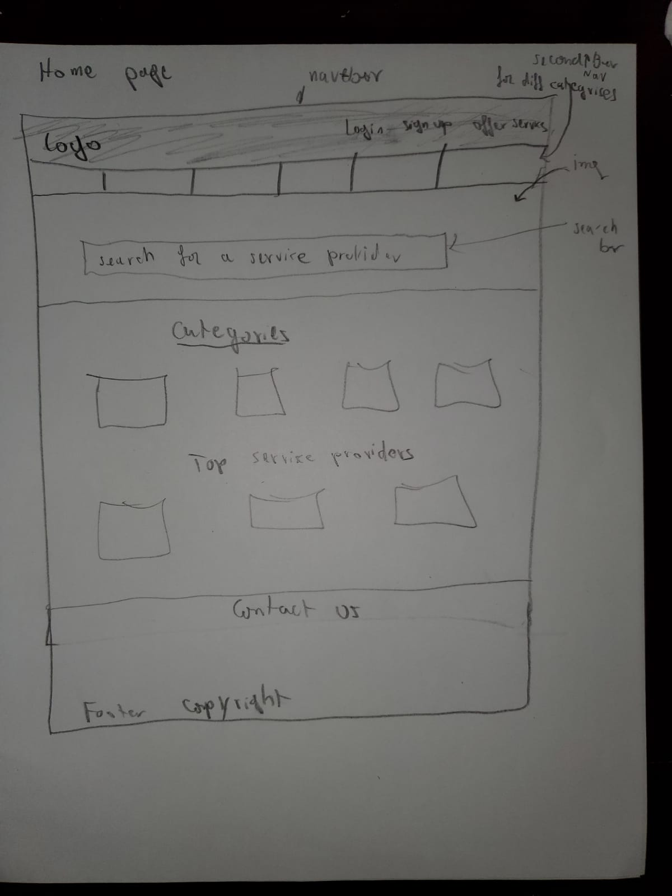
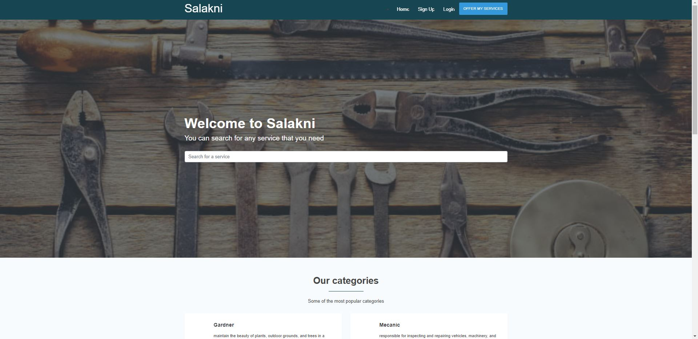
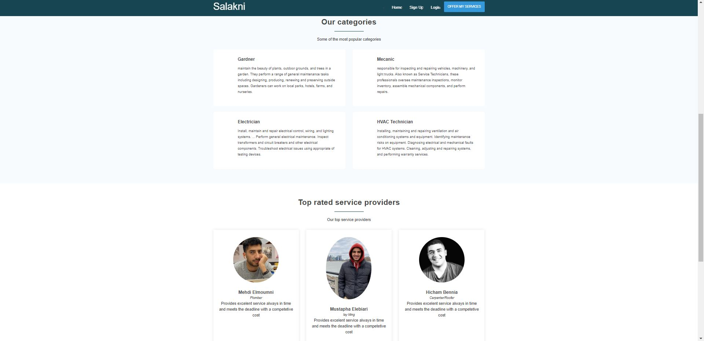
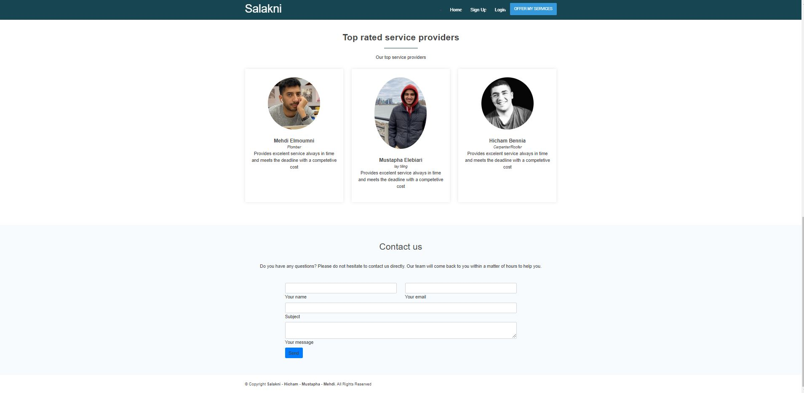
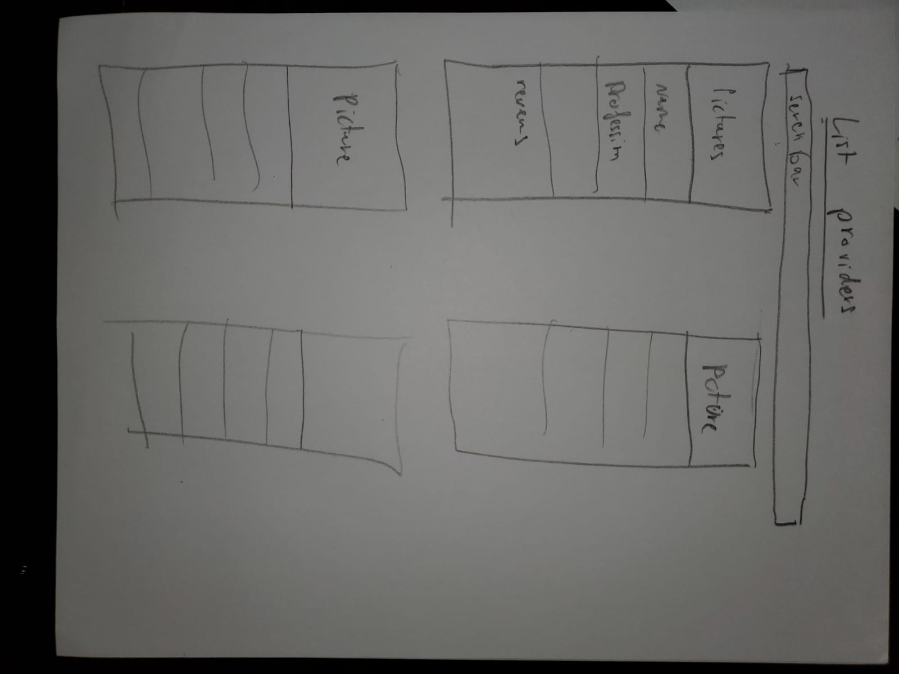
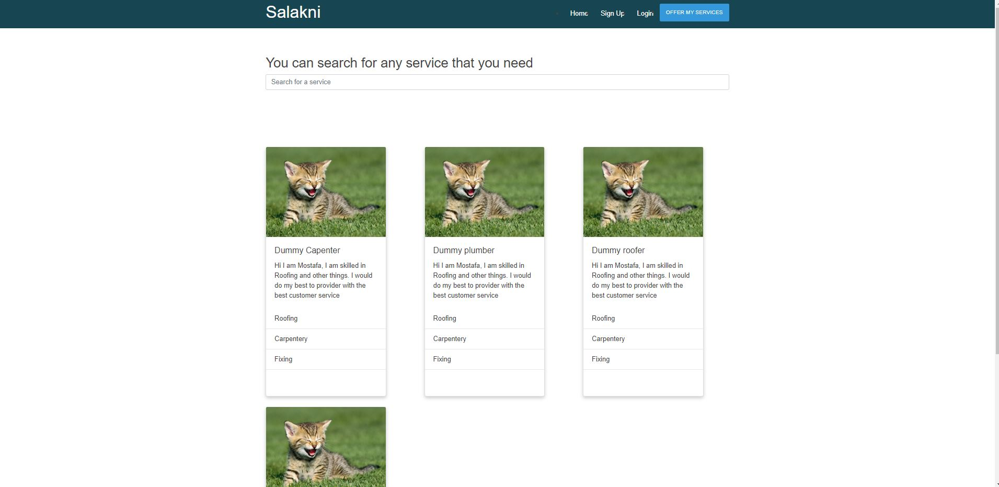
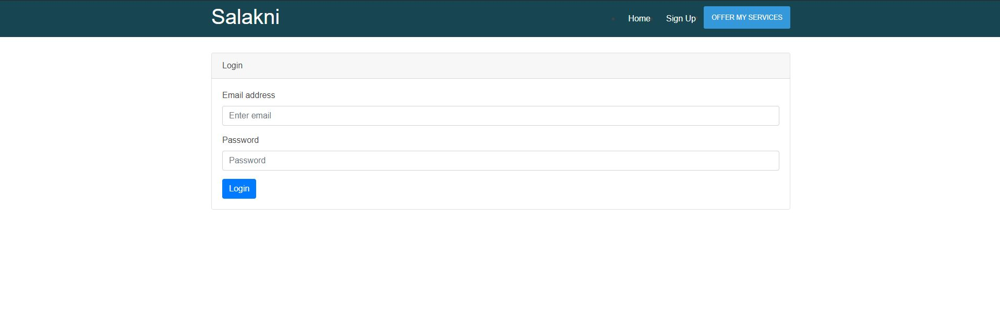
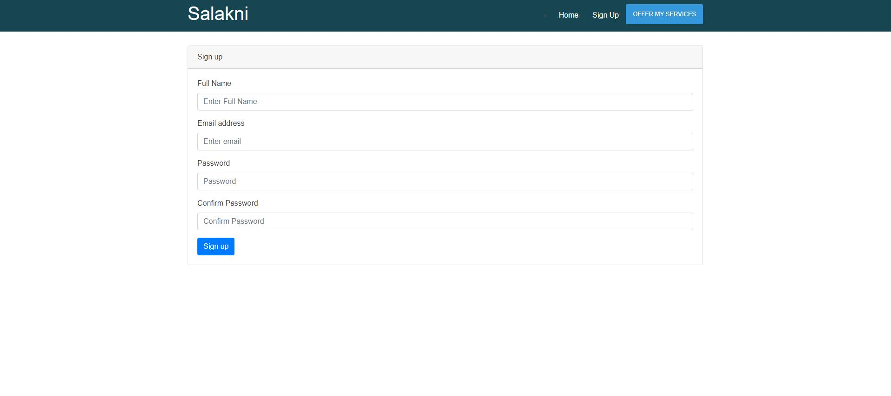

# TEAM NAME

* Delta

# WEB APPLICATION NAME

* Salakni

# Team Overview

* Mostafa Elebiary,
* Hicham Bennia, 
* Mehdi Elmoumni,

# Data Iteraction
* Names of providers.
* Ratings of providers.
* Skills of providers.
* Location and availability of providers.
* Contact information of providers.
* Customers information.

# User Interface

Provide a description and images of the user interface your
application will intend on supporting.

The above image is a screenshot and mockup of the homepage, where we welcome the cusomters and have giving the immidiate ability to search the different serivice providers we have, so they can immediately start viewing and intracting with our page.

The above image is a screenshot of the homepage scrolled down a little bit, where customers can see some general information on what we offer and some our highly rated providers.

The above image is a screenshot of the homepage scrolled down a little bit more, where customers can contact us and ask any questions they have or any requests they have for the website.

The above image and mockup is the the page where the user will see the different providers after they search or they navigate manually to it so they can contanct those providers and see the many options we have or they can search for some other providers or skills. Also, they would also be able to filter based on the different skills.

The above image would be the login page, which will show up if the user clicked on login from the navigation bar, or they clicked on something that requires the user to be signed in eg. Contacting providers.

The above image would be the signup page, which will allow the user to signup if they don't already have an account, this page will show up if the user clicked on signup from the navigation bar or they would like to do an action that requires them to be signed in.

# Division of work
* Mostafa Elebiary: provider page
* Hicham Bennia: Homepage
* Mehdi Elmoumni: Login page and signup page