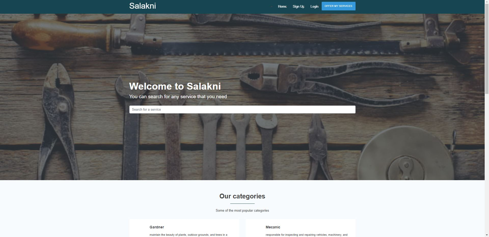
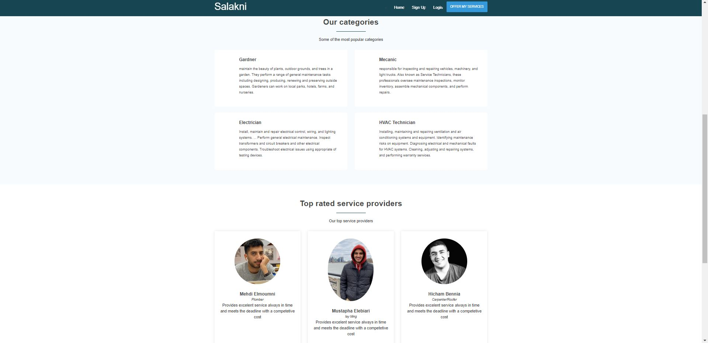
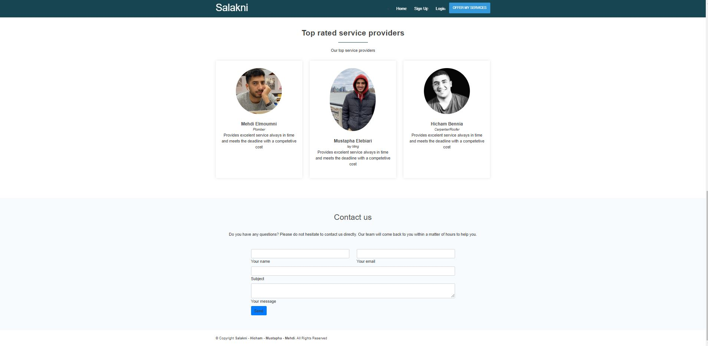
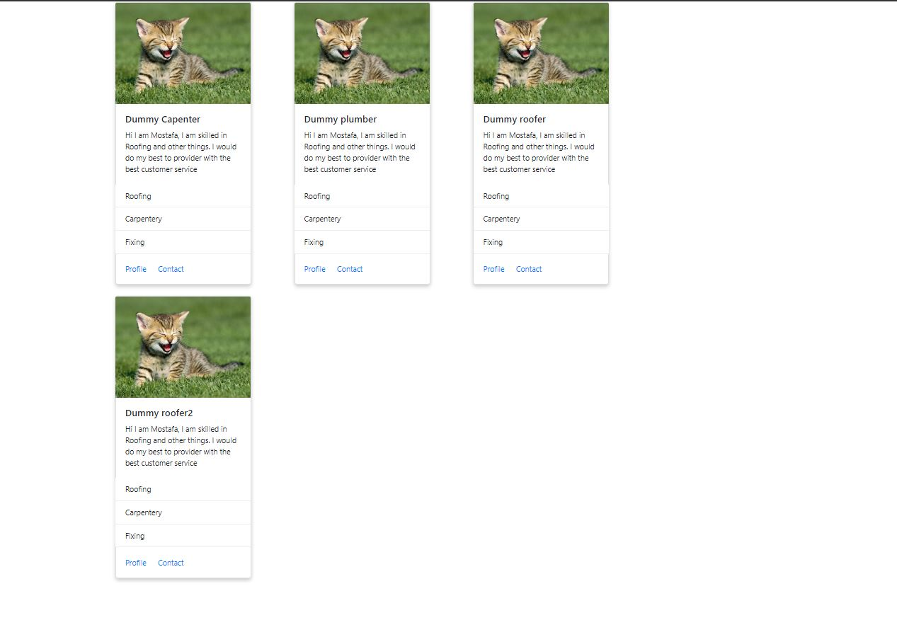

# TEAM NAME

* Delta

# WEB APPLICATION NAME

* Salakni

# Team Overview

* Mostafa Elebiary, melebiary
* Hicham Bennia, 
* Mehdi Elmoumni, ,

# Data Iteraction
* Names of providers.
* Ratings of providers.
* Skills of providers.
* Location and avaialbitly of providers.
* Contact information of providers.
* Customers information.

# User Interface

Provide a description and images of the user interface your
application will intend on supporting.

The above image is a screenshot and mockup of the homepage, where we welcome the cusomters and have giving the immidiate ability to search the different serivice providers we have, so they can immediately start viewing and intracting with our page.

The above image is a screenshot of the homepage scrolled down a little bit, where customers can see some general information on what we offer and some our highly rated providers.

The above image is a screenshot of the homepage scrolled down a little bit more, where customers can contact us and ask any questions they have or any requests they have for the website.

The above image and mockup is the the page where the user will see the different providers after they search or they navigate manually to it s they can contanct those proividers and see the many options we have. Also, they would also be able to filter based on the different skills.

# Division of work
* Mostafa Elebiary: provider page
* Hicham Bennia: Homepage
