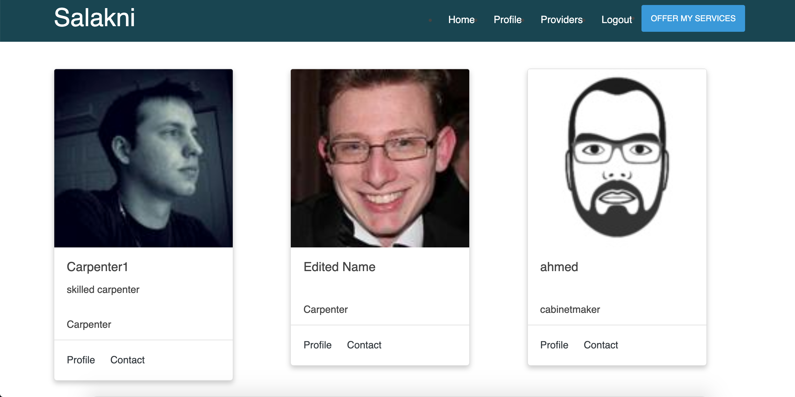
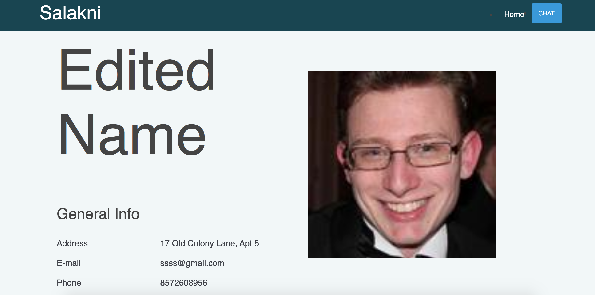

# TEAM NAME

* Delta

# WEB APPLICATION NAME

* Salakni
# SEMESTER

* Spring 2020

# OVERVIEW

so our project  is to create an online service marketplace for both private and professional service providers.
The customers wil then be able to see their profolios and contact them through the website.


This section of the document enlists the over-all understanding about the project.

1)	Create an online directory listing website where service providers (babysitters plumbers, gardners……….) can post their services on the website and service seekers can request their services by posting their requirements. 

2)	There will be two user roles in the website namely: Customer, Provider.

3)	users(client or provider) need to register to see the information of the provider. 

4)	providers will need to register on the website to post their services.
 
5)	clients will have several options to work on the website : 

    user logs into their account; they will have their own dashboard to manage their profile and updates their informations.
    
    customer can go to the providers profiles and check their informations (address, email, phone number).
    

6)	Providers will have several options on the website such as: 

    user logs into their account; they will have their own dashboard to manage their profile and updates their informations.
        
    provider can go to see all providers profiles and check their informations (address, email, phone number).


# Team Members

* Hicham Bennia: HichBen

* El Mehdi Moumni: Mehdi136

* Mostafa Elebiary: melebiary

# Video Link

https://www.youtube.com/watch?v=lGFJitVr81U&list=PLbTmqqGclWPIyj1DOb6WwfmpuYCC78vzR&index=2&t=0s
# Heroku URL

https://dry-garden-88062.herokuapp.com/


# User Interface

Provide a description and images of the user interface your
application will intend on supporting.


The above image is a screenshot and mockup of the homepage, where we welcome the cusomters and have giving the immidiate ability to search the different serivice providers we have, so they can immediately start viewing and intracting with our page.


The above image is a screenshot of the homepage scrolled down a little bit, where customers can see some general information on what we offer and some our highly rated providers.


The above image is a screenshot of the homepage scrolled down a little bit more, where customers can contact us and ask any questions they have or any requests they have for the website.



The above image is a screenshot of the profile scrolled down a little bit more, where customers can contact us and ask any questions they have or any requests they have for the website.




The above images are screenshots of the provider profile page with their info


The above images is a screenshot of the profile design.

# Division of work
* Mostafa Elebiary: Worked on the authentication, static serving in html files. Mostafa was responsible for milestone1.md documentation.
* Hicham Bennia: Worked on the provider profile and made the porvider api. Hichem was responsible for ideas.md and milstone2.md documentation.
* Mehdi Elmoumni: Worked on the client profile and made the client api. El Mehdi was responsible for milestone3.md and final.md documentation.
* team work: worked on the Heroku together. 


# Api and database documentation

  Returns json data about a single user.
  * **Install **
  Run the command below
  `npm install`
  * **Start **
To start the api, run the following command:
  `npm start`
  * **clean **
To start the api, run the following command:
  `npm clean`
  The command below will clean up the api folder and re-run a clean install.

**APIs** :
Our API works with Node.js, Express.js and MongoDB.
It's based on typescript and runs on the server
we use npm modules to help us construct and build the API

 **Database**: 
We use MongoDB for database and Mongoose from npm
to handle working with it
we have 2 Model Schemas for Clients and Providers

```sh
$ cd dillinger
$ npm install -d
$ node app
```
```sh
$ client : {
$   email: string;
$    password: string;
$    name: string;
$    phone: string;
$    address: string;
$    type: string;
$    photo: string
$}
```
```sh
$provider : {
$    email: string;
$    password: string;
$    name: string;
$    skills: string[];
$    photo: string;
$    phone: string;
$    address: string;
$    description: string;
$}
```

we give a type for each field in the model so that we decide what's gonna save in it
* **URL Routes:**  
```sh
$ POST /register => register client or provider
$ POST /login => login client or provider
$ GET /logout => logout client or provider
$ GET /getuser => get logged in user details
$ POST /addpic => add picture and get its url
$ GET /clients => get all clients
$ GET /clients/:client_id => get client by id
$ POST /clients/:client_id/update => update client
$ GET /api/providers => get all providers
$ GET /api/providers/:provider_id => get provider by id
$ POST /api/providers/:provider_id/update => update provider
```

* **Pages**
```sh
$ /               index page ( can be accesed by everyone )
$ /register       register page ( can't be accesed if user is logged in )
$ /login          login page ( can't be accesed if user is logged in )
$ /user           user page ( can't be accesed if user is not logged in )
$ /providers      providers page ( can't be accesed if user is not logged in )
$ /provider       providers page ( can be accesed by everyone ) and get the provider by query ?id=providerID
```
# Authentication:

we use passport and passport local to handle authentication in the APP
we depend on express-session and cookie parser to save the logged in user in the session
so we can use it's details
also, we use functions to restrict user or allow him to access some pages based on his login

register and login pages can't be accesed if the user is logged in
providers and update user can be accesed just when user is logged in

# Conclusion

The aim of the project was to make a complete, fully working web based project for providing services to clients. This project was a lot of experience gaining, from Software knowledge to building teamwork skills. Our API works with Node.js, Express.js and MongoDB. We use MongoDB for database and Mongoose from npm to handle working with it, and we used passport and passport local to handle authentication in the APP. One of the biggest problems we faced in the project was the time framework. The first idea for the project was too big and it will take way more time than we have, so the best solution our team came up with is to remove some functions for the project, and still keep the purpose of the website present. 

