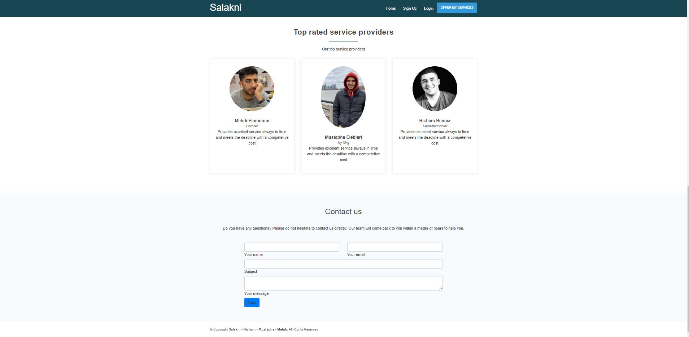

# TEAM NAME

* Delta

# WEB APPLICATION NAME

* Salakni

# Team Overview

* Mostafa Elebiary,
* Hicham Bennia, 
* Mehdi Elmoumni,

# User Interface

Provide a description and images of the user interface your
application will intend on supporting.

The above image is a screenshot and mockup of the homepage, where we welcome the cusomters and have giving the immidiate ability to search the different serivice providers we have, so they can immediately start viewing and intracting with our page.

The above image is a screenshot of the homepage scrolled down a little bit, where customers can see some general information on what we offer and some our highly rated providers.

The above image is a screenshot of the homepage scrolled down a little bit more, where customers can contact us and ask any questions they have or any requests they have for the website.

The above images are screenshots of the provider profile page with dummy stuff

# Division of work
* Mostafa Elebiary: Worked the review back-end and implemented the review API,
he also fixed the mvc model and different routes since every person worked on his own piece and handeled the deployment
* Hicham Bennia: Worked on the provider profile and made the porvider api, and was responsible of the documentation
* Mehdi Elmoumni: Worked on the user page and made the client api, he also made the main web server index.ts.

# Heroku URL

# Api documentation
 **Client APIs**
----
  Returns json data about a single user.
  * **Install**
  Run the command below
  `npm install`
  * **Start **
To start the api, run the following command:
  `npm start`
  * **clean **
To start the api, run the following command:
  `npm clean`
  The command below will clean up the api folder and re-run a clean install.

* **URL**

  /clients
  /provider
  /review
  

* **Method:**
  GET /client
GET /client/{clientid} POST /client
PUT /client/{clientid}

GET /providers
GET /providers/{providerid} POST /providers
PUT /providers/{providerid}

POST /authenticate / Authenticate login for providers and clients
GET /reviews/providers/{providerid} given provider
POST /reviews/providers/{providerid} a provider
PUT /reviews/providers/{providerid}
DELETE /reviews/providers/{providerid}

  `GET` | `POST` | `DELETE` | `PUT`
  
*  **URL Params**

   **Required:**
 
   `clientid=[integer]`

* **Data Params**

  None

* **Success Response:**

  **Code:** 200  
    **Code:** 201  
 
* **Error Response:**

  * **Code:** 404 NOT FOUND  
    **Content:** `{ error : "User doesn't exist" }`

  OR

  * **Code:** 401 UNAUTHORIZED  
    **Content:** `{ error : "You are unauthorized to make this request." }`
