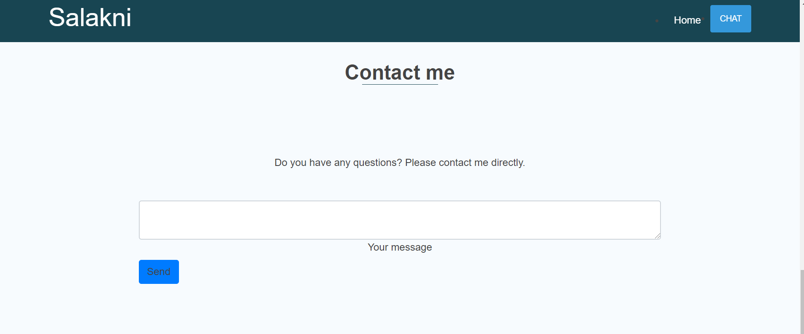

# TEAM NAME

* Delta

# WEB APPLICATION NAME

* Salakni

# Team Overview

* Mostafa Elebiary,
* Hicham Bennia, 
* Mehdi Elmoumni,

# Heroku URL

https://dry-garden-88062.herokuapp.com/

# User Interface

Provide a description and images of the user interface your
application will intend on supporting.

The above image is a screenshot and mockup of the homepage, where we welcome the cusomters and have giving the immidiate ability to search the different serivice providers we have, so they can immediately start viewing and intracting with our page.

The above image is a screenshot of the homepage scrolled down a little bit, where customers can see some general information on what we offer and some our highly rated providers.

The above image is a screenshot of the homepage scrolled down a little bit more, where customers can contact us and ask any questions they have or any requests they have for the website.

The above images are screenshots of the provider profile page with dummy stuff

# Division of work
* Mostafa Elebiary: Worked on the authentication, static serving in html files.
* Hicham Bennia: Worked on the provider profile and made the porvider api.
* Mehdi Elmoumni: Worked on the provider profile and made the porvider api and was responsible of the documentation.
* team work: worked on the Heroku together. 
# Heroku URL

# Api and database documentation

  Returns json data about a single user.
  * **Install**
  Run the command below
  `npm install`
  * **Start **
To start the api, run the following command:
  `npm start`
  * **clean **
To start the api, run the following command:
  `npm clean`
  The command below will clean up the api folder and re-run a clean install.
**APIs**
Our API works with Node.js, Express.js and MongoDB.
It's based on typescript and runs on the server
we use npm modules to help us construct and build the API

**Database**
We use MongoDB for database and Mongoose from npm
to handle working with it
we have 2 Model Schemas for Clients and Providers

client : {
    email: string;
    password: string;
    name: string;
    phone: string;
    address: string;
    type: string;
    photo: string
}

provider : {
    email: string;
    password: string;
    name: string;
    skills: string[];
    photo: string;
    phone: string;
    address: string;
    description: string;
}

we give a type for each field in the model so that we decide what's gonna save in it
# URL Routes: 

POST /register => register client or provider
POST /login => login client or provider
GET /logout => logout client or provider
GET /getuser => get logged in user details
POST /addpic => add picture and get its url
GET /clients => get all clients
GET /clients/:client_id => get client by id
POST /clients/:client_id/update => update client
GET /api/providers => get all providers
GET /api/providers/:provider_id => get provider by id
POST /api/providers/:provider_id/update => update provider

# Pages 

/               index page ( can be accesed by everyone )
/register       register page ( can't be accesed if user is logged in )
/login          login page ( can't be accesed if user is logged in )
/user           user page ( can't be accesed if user is not logged in )
/providers      providers page ( can't be accesed if user is not logged in )
/provider       providers page ( can be accesed by everyone ) and get the provider by query ?id=providerID

# Authentication:

we use passport and passport local to handle authentication in the APP
we depend on express-session and cookie parser to save the logged in user in the session
so we can use it's details
also, we use functions to restrict user or allow him to access some pages based on his login

register and login pages can't be accesed if the user is logged in
providers and update user can be accesed just when user is logged in
